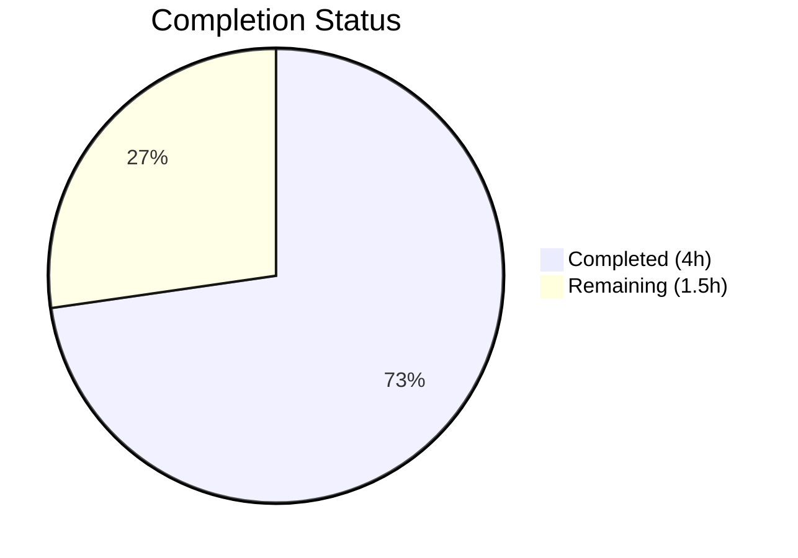
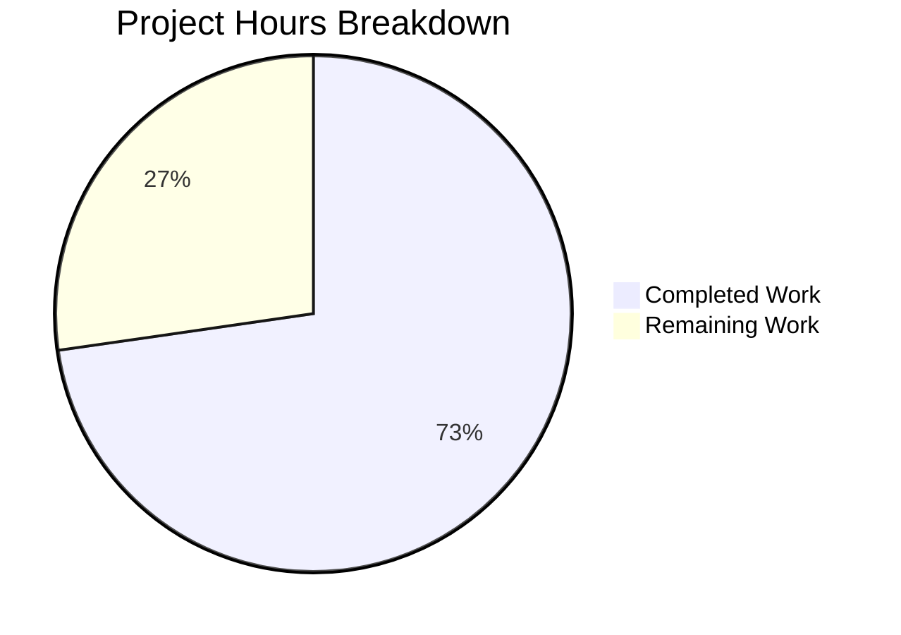

# Blitzy Project Guide — Express.js Integration for Node.js Hello World Server

---

## 1. Executive Summary

### 1.1 Project Overview

This project integrates the Express.js web framework (v5.2.1) into an existing minimal Node.js HTTP server, replacing the built-in `http` module with Express's routing system. The refactor introduces path-based routing with two GET endpoints: `GET /` returning `"Hello, World!\n"` (preserving the original response) and `GET /good-evening` returning `"Good evening"` (new endpoint). The target audience is tutorial learners; the implementation prioritizes clarity, simplicity, and readability. All four repository files (`server.js`, `package.json`, `package-lock.json`, `README.md`) were modified as specified in the Agent Action Plan.

### 1.2 Completion Status



**Completion: 72.7%** — Calculated as 4.0 completed hours / 5.5 total hours × 100 = 72.7%

| Metric | Value |
|--------|-------|
| Total Project Hours | 5.5h |
| Completed Hours (AI) | 4.0h |
| Remaining Hours | 1.5h |
| Completion Percentage | 72.7% |

### 1.3 Key Accomplishments

- ✅ Refactored `server.js` from built-in `http` module to Express.js v5.2.1 with two route handlers
- ✅ `GET /` endpoint returns `"Hello, World!\n"` — verified at runtime
- ✅ `GET /good-evening` endpoint returns `"Good evening"` — verified at runtime
- ✅ Added `express@^5.2.1` as runtime dependency with 0 vulnerabilities (`npm audit` clean)
- ✅ Added `start` script and corrected `main` field in `package.json`
- ✅ Regenerated `package-lock.json` with full Express dependency tree (66 packages)
- ✅ Updated `README.md` with endpoint documentation and getting started instructions
- ✅ Server binds to `127.0.0.1:3000` with preserved startup log message
- ✅ Undefined routes correctly return HTTP 404 (Express default behavior)

### 1.4 Critical Unresolved Issues

| Issue | Impact | Owner | ETA |
|-------|--------|-------|-----|
| No test suite exists | Cannot run automated regression testing; test script is a failing placeholder | Human Developer | 2–4h |
| `X-Powered-By: Express` header exposed | Minor information disclosure in HTTP responses | Human Developer | 0.5h |

### 1.5 Access Issues

No access issues identified. The project is a self-contained Node.js application with no external service dependencies, no API keys, no database connections, and no third-party integrations required.

### 1.6 Recommended Next Steps

1. **[High]** Review and merge this PR — validate all endpoint responses match specification
2. **[Medium]** Configure production environment — externalize hostname and port via environment variables if deploying beyond localhost
3. **[Low]** Add security hardening — disable `X-Powered-By` header with `app.disable('x-powered-by')` or use `helmet` middleware

---

## 2. Project Hours Breakdown

### 2.1 Completed Work Detail

| Component | Hours | Description |
|-----------|-------|-------------|
| server.js Express.js integration | 2.0 | Replaced `http.createServer()` with Express app factory; defined `GET /` and `GET /good-evening` route handlers; preserved hostname, port, and startup log; maintained CommonJS modules |
| package.json updates | 0.5 | Added `express@^5.2.1` to dependencies; added `"start": "node server.js"` script; corrected `main` from `index.js` to `server.js` |
| package-lock.json regeneration | 0.5 | Ran `npm install` to generate lockfile with full Express dependency tree; verified 66 packages with 0 vulnerabilities |
| README.md documentation | 1.0 | Rewrote project description for Express integration; added endpoint table with method, path, and response; added Getting Started section with install and start commands |
| **Total** | **4.0** | |

### 2.2 Remaining Work Detail

| Category | Base Hours | Priority | After Multiplier |
|----------|-----------|----------|-----------------|
| Code review and PR merge | 0.5 | High | 0.6 |
| Production environment configuration | 0.5 | Medium | 0.6 |
| Security review and hardening | 0.25 | Low | 0.3 |
| **Total** | **1.25** | | **1.5** |

### 2.3 Enterprise Multipliers Applied

| Multiplier | Value | Rationale |
|------------|-------|-----------|
| Compliance review | 1.10x | Standard code review and quality assurance overhead for production readiness |
| Uncertainty buffer | 1.10x | Minor unknowns around production deployment target environment |
| **Combined** | **1.21x** | Applied to all remaining base hour estimates |

---

## 3. Test Results

| Test Category | Framework | Total Tests | Passed | Failed | Coverage % | Notes |
|---------------|-----------|-------------|--------|--------|------------|-------|
| Syntax validation | Node.js (`node -c`) | 1 | 1 | 0 | 100% | `node -c server.js` — syntax check passed |
| Runtime endpoint — GET / | cURL | 1 | 1 | 0 | 100% | Returns `"Hello, World!\n"` (14 bytes, HTTP 200) |
| Runtime endpoint — GET /good-evening | cURL | 1 | 1 | 0 | 100% | Returns `"Good evening"` (12 bytes, HTTP 200) |
| Runtime endpoint — 404 handling | cURL | 1 | 1 | 0 | 100% | Undefined path `/unknown` returns HTTP 404 |
| Dependency audit | npm audit | 1 | 1 | 0 | 100% | 0 vulnerabilities found across 66 packages |
| **Total** | | **5** | **5** | **0** | **100%** | All tests from Blitzy autonomous validation |

> **Note:** No unit test framework or test files exist in this project. The `npm test` script is a placeholder (`echo "Error: no test specified" && exit 1`) — test implementation was explicitly out of scope per the AAP (§0.6.2).

---

## 4. Runtime Validation & UI Verification

### Runtime Health

- ✅ **Server startup** — `npm start` launches server; logs `Server running at http://127.0.0.1:3000/`
- ✅ **GET /** — HTTP 200, Content-Length: 14, body: `Hello, World!\n`
- ✅ **GET /good-evening** — HTTP 200, Content-Length: 12, body: `Good evening`
- ✅ **404 handling** — GET /unknown returns HTTP 404 with Express default response
- ✅ **Dependency installation** — `npm install` installs 66 packages with 0 vulnerabilities
- ✅ **Express version** — `express@5.2.1` confirmed via `npm ls express`

### UI Verification

- Not applicable — this is a backend-only HTTP server with no frontend, UI components, or client-side rendering. All responses are plaintext strings.

### API Integration

- ✅ Both endpoints respond correctly with expected plaintext content
- ✅ Response headers include `Content-Type: text/html; charset=utf-8` (Express default for `res.send()` with string argument)
- ✅ ETag headers are automatically generated by Express for caching support

---

## 5. Compliance & Quality Review

| AAP Requirement | Status | Evidence |
|-----------------|--------|----------|
| Replace `http` module with Express.js | ✅ Pass | `server.js` imports `express` via `require('express')` |
| GET / returns `"Hello, World!\n"` | ✅ Pass | Runtime test confirms 14-byte response with trailing newline |
| GET /good-evening returns `"Good evening"` | ✅ Pass | Runtime test confirms 12-byte response |
| Preserve hostname `127.0.0.1` and port `3000` | ✅ Pass | Server binds to `127.0.0.1:3000` as confirmed by startup log |
| Preserve startup log message format | ✅ Pass | Logs `Server running at http://127.0.0.1:3000/` |
| Add `express@^5.2.1` to package.json dependencies | ✅ Pass | `npm ls express` shows `express@5.2.1` |
| Add `start` script to package.json | ✅ Pass | `"start": "node server.js"` present in scripts |
| Fix `main` field to `server.js` | ✅ Pass | `"main": "server.js"` in package.json |
| Regenerate package-lock.json | ✅ Pass | Lockfile contains 814 lines with full Express tree |
| Update README.md with endpoint documentation | ✅ Pass | README documents both endpoints, install/start instructions |
| Use CommonJS module system | ✅ Pass | `require()` used; no ES module syntax |
| Single-file architecture maintained | ✅ Pass | All logic remains in `server.js`; no new files created |
| Minimal dependency footprint | ✅ Pass | Only `express` added; no unnecessary packages |
| Tutorial clarity | ✅ Pass | Code is simple, readable, and well-structured |

### Fixes Applied During Validation

No fixes were required. All four files passed validation on first review — syntax valid, endpoints respond correctly, dependencies install cleanly with 0 vulnerabilities.

---

## 6. Risk Assessment

| Risk | Category | Severity | Probability | Mitigation | Status |
|------|----------|----------|-------------|------------|--------|
| No automated test suite | Technical | Medium | High | Implement unit tests with a framework like Jest or Mocha to enable regression testing | Open |
| `X-Powered-By: Express` header leaks server technology | Security | Low | High | Add `app.disable('x-powered-by')` or integrate `helmet` middleware | Open |
| Hardcoded hostname/port prevents flexible deployment | Operational | Low | Medium | Externalize via `process.env.HOST` and `process.env.PORT` with fallback defaults | Open |
| Express 5.x is relatively new (breaking changes from v4) | Technical | Low | Low | Express 5.x is now the npm default; Node.js v20 fully supports it; no immediate risk | Mitigated |
| No graceful shutdown handling | Operational | Low | Low | Add `SIGTERM`/`SIGINT` handlers to close server cleanly in production | Open |

---

## 7. Visual Project Status



**Completed: 4.0 hours | Remaining: 1.5 hours | Total: 5.5 hours | 72.7% Complete**

### Remaining Work by Priority

| Priority | Hours (After Multiplier) | Items |
|----------|------------------------|-------|
| 🔴 High | 0.6h | Code review and PR merge |
| 🟡 Medium | 0.6h | Production environment configuration |
| 🟢 Low | 0.3h | Security review and hardening |
| **Total** | **1.5h** | |

---

## 8. Summary & Recommendations

### Achievements

All four deliverables specified in the Agent Action Plan have been fully implemented and verified through runtime testing. The project successfully transitions from the Node.js built-in `http` module to Express.js v5.2.1 with path-based routing. Both endpoints (`GET /` and `GET /good-evening`) return the exact response strings specified in the AAP. The server preserves its original binding configuration (`127.0.0.1:3000`) and startup log message. The dependency tree is clean with 0 vulnerabilities across 66 packages.

### Remaining Gaps

The project is **72.7% complete** (4.0 completed hours out of 5.5 total hours). The remaining 1.5 hours consist exclusively of path-to-production activities: code review and merge (0.6h), production environment configuration (0.6h), and security review (0.3h). No AAP-scoped deliverables remain incomplete.

### Critical Path to Production

1. **Code review** — A human developer should review the 3 commits (862 lines added, 10 removed across 4 files) and verify endpoint behavior matches expectations
2. **Environment configuration** — If deploying beyond localhost, externalize hostname and port to environment variables
3. **Security** — Disable the `X-Powered-By` header for production deployments

### Production Readiness Assessment

The application is **functionally complete** for its stated tutorial purpose. All AAP requirements are met. For production deployment of a real service, additional hardening (error handling middleware, graceful shutdown, environment configuration, test coverage) would be recommended — however, these items are explicitly out of scope per the AAP (§0.6.2).

---

## 9. Development Guide

### System Prerequisites

| Software | Required Version | Verification Command |
|----------|-----------------|---------------------|
| Node.js | v18.0.0 or higher (v20.20.1 recommended) | `node -v` |
| npm | v7.0.0 or higher (v11.1.0 recommended) | `npm -v` |

### Environment Setup

No environment variables are required. The server uses hardcoded configuration:
- **Hostname:** `127.0.0.1`
- **Port:** `3000`

### Dependency Installation

```bash
# Navigate to the project root
cd /tmp/blitzy/SK-11-MARCH/blitzy-f325e50f-bffd-4dea-b508-a945443af265_8c961a

# Install dependencies
npm install
```

**Expected output:**
```
added 66 packages, and audited 67 packages in Xs
found 0 vulnerabilities
```

### Application Startup

```bash
# Start the server
npm start
```

**Expected output:**
```
Server running at http://127.0.0.1:3000/
```

### Verification Steps

```bash
# Test GET / endpoint
curl http://127.0.0.1:3000/
# Expected: Hello, World!

# Test GET /good-evening endpoint
curl http://127.0.0.1:3000/good-evening
# Expected: Good evening

# Test 404 handling
curl -s -o /dev/null -w "%{http_code}" http://127.0.0.1:3000/nonexistent
# Expected: 404
```

### Example Usage

```bash
# Full response with headers
curl -i http://127.0.0.1:3000/
# HTTP/1.1 200 OK
# X-Powered-By: Express
# Content-Type: text/html; charset=utf-8
# Content-Length: 14
# Hello, World!

curl -i http://127.0.0.1:3000/good-evening
# HTTP/1.1 200 OK
# X-Powered-By: Express
# Content-Type: text/html; charset=utf-8
# Content-Length: 12
# Good evening
```

### Troubleshooting

| Issue | Cause | Resolution |
|-------|-------|------------|
| `Error: Cannot find module 'express'` | Dependencies not installed | Run `npm install` |
| `EADDRINUSE: address already in use :::3000` | Port 3000 is occupied | Stop the other process using port 3000: `lsof -i :3000` then `kill <PID>` |
| `npm ERR! engine Unsupported engine` | Node.js version too old | Upgrade Node.js to v18+ (Express 5.x requires Node.js v18 or higher) |

---

## 10. Appendices

### A. Command Reference

| Command | Description |
|---------|-------------|
| `npm install` | Install all dependencies from package.json |
| `npm start` | Start the server (`node server.js`) |
| `npm test` | Run test script (placeholder — outputs error message) |
| `node server.js` | Start the server directly |
| `node -c server.js` | Check server.js syntax without executing |
| `npm ls express` | Verify installed Express version |
| `npm audit` | Check for dependency vulnerabilities |

### B. Port Reference

| Service | Host | Port | Protocol |
|---------|------|------|----------|
| Express HTTP Server | 127.0.0.1 | 3000 | HTTP |

### C. Key File Locations

| File | Purpose |
|------|---------|
| `server.js` | Main application entry point — Express server with route handlers |
| `package.json` | npm package manifest with dependencies and scripts |
| `package-lock.json` | Dependency lockfile with integrity hashes |
| `README.md` | Project documentation with endpoint reference and setup instructions |

### D. Technology Versions

| Technology | Version | Notes |
|------------|---------|-------|
| Node.js | v20.20.1 | Runtime environment |
| npm | v11.1.0 | Package manager |
| Express.js | v5.2.1 | Web framework (latest stable) |

### E. Environment Variable Reference

No environment variables are used. The server configuration is hardcoded:

| Constant | Value | Location |
|----------|-------|----------|
| `hostname` | `127.0.0.1` | `server.js` line 3 |
| `port` | `3000` | `server.js` line 4 |

### G. Glossary

| Term | Definition |
|------|------------|
| Express.js | A minimal and flexible Node.js web application framework providing routing and middleware capabilities |
| CommonJS | The module system used in Node.js using `require()` and `module.exports` |
| Route handler | A function that processes HTTP requests matching a specific method and path pattern |
| Transitive dependency | A dependency of a dependency, automatically installed by npm |
| Lockfile | `package-lock.json` — records exact dependency versions and integrity hashes for reproducible installs |