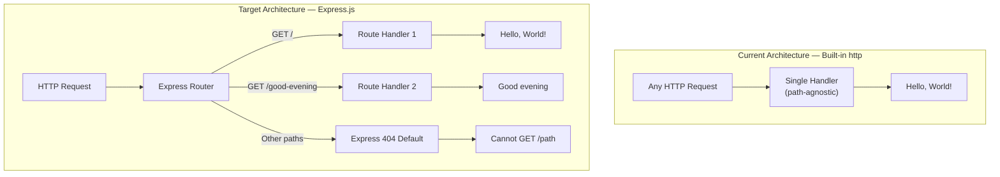

# Technical Specification

# 0. Agent Action Plan

## 0.1 Intent Clarification

### 0.1.1 Core Feature Objective

Based on the prompt, the Blitzy platform understands that the new feature requirement is to:

- **Integrate Express.js into the existing Node.js project** — The current `server.js` uses the Node.js built-in `http` module to create a basic HTTP server. The user requests replacing this raw `http` approach with the Express.js web framework to enable routing capabilities, middleware support, and a more structured request-handling pattern.

- **Add a new HTTP endpoint that returns "Good evening"** — In addition to the existing "Hello World" response currently served at all paths, a new dedicated endpoint must be created that returns the plaintext response `"Good evening"`. This implies the introduction of path-based routing, where different URL paths return different responses.

- **Preserve the existing "Hello World" response** — The original behavior of returning `"Hello, World!\n"` must be maintained under a defined route (the root path `/`), ensuring backward compatibility with any consumers of the existing endpoint.

Implicit requirements detected:

- The server must continue to listen on the same host (`127.0.0.1`) and port (`3000`) to maintain consistency with the existing configuration
- The `package.json` must be updated to include Express.js as a runtime dependency
- The `package-lock.json` will be regenerated to reflect the new dependency tree
- A `start` script should be added to `package.json` for standardized server startup

### 0.1.2 Special Instructions and Constraints

- The user described this as a **tutorial project**, indicating the implementation should favor clarity, simplicity, and readability over advanced patterns
- No specific Express.js version was requested; the implementation will use **Express.js v5.2.1**, the latest stable release currently available on npm
- No authentication, middleware, or advanced configuration was requested
- No database, persistence, or external service integration is implied
- The user provided no Figma designs, no environment variables, and no custom implementation rules

### 0.1.3 Technical Interpretation

These feature requirements translate to the following technical implementation strategy:

- To **integrate Express.js**, we will refactor `server.js` to replace the `http.createServer()` pattern with the Express application factory (`express()`) and Express's built-in routing system (`app.get()`)
- To **serve the "Hello World" response**, we will create a `GET /` route handler in `server.js` that sends the plaintext response `"Hello, World!\n"`
- To **add the "Good evening" endpoint**, we will create a `GET /good-evening` route handler in `server.js` that sends the plaintext response `"Good evening"`
- To **register Express.js as a dependency**, we will add `express` to the `dependencies` field in `package.json` and regenerate `package-lock.json` via `npm install`
- To **maintain server binding**, we will preserve the hostname `127.0.0.1` and port `3000` in the Express `app.listen()` call
- To **update project metadata**, we will add a `start` script to `package.json` pointing to `node server.js` for standardized startup

## 0.2 Repository Scope Discovery

### 0.2.1 Comprehensive File Analysis

The repository is a minimal Node.js project containing exactly four files at the root level with zero subdirectories. Every file has been inspected and evaluated for impact.

**Existing Files Requiring Modification:**

| File | Current Purpose | Modification Required | Impact Level |
|------|----------------|----------------------|-------------|
| `server.js` | 14-line HTTP server using built-in `http` module; returns `"Hello, World!\n"` for all requests regardless of path or method | **Major refactor** — Replace `http.createServer()` with Express application; add route definitions for `GET /` and `GET /good-evening` | Critical |
| `package.json` | npm manifest for `hello_world@1.0.0`; zero dependencies; placeholder test script; `main` set to `index.js` | **Modify** — Add `express` to `dependencies`; add `start` script (`node server.js`); optionally update `main` to `server.js` | Critical |
| `package-lock.json` | Lockfile version 3 with empty dependency tree (root package only) | **Auto-regenerated** — Will be updated by `npm install` to include the Express dependency tree | Critical |
| `README.md` | Two-line file identifying `hao-backprop-test` with "Do not touch!" governance notice | **Modify** — Update description to reflect the Express-based server with two endpoints and document available routes | Low |

**Integration Point Discovery:**

- **API endpoints**: Currently none (path-agnostic handler). After modification, two explicit route handlers:
  - `GET /` — Returns `"Hello, World!\n"`
  - `GET /good-evening` — Returns `"Good evening"`
- **Database models/migrations**: None exist and none are needed
- **Service classes**: None exist; this is a single-file application
- **Controllers/handlers**: The single request handler in `server.js` (lines 6–10) will be split into two Express route handlers
- **Middleware/interceptors**: None exist; no middleware is required for this feature addition

### 0.2.2 Web Search Research Conducted

- **Express.js latest stable version**: Confirmed as v5.2.1 via npm registry. Express 5.x is now the default on npm, requires Node.js v18+, and includes native async/await middleware support, improved routing via `path-to-regexp@8.x`, and automatic promise rejection handling.
- **Express.js basic routing pattern**: Standard pattern uses `app.get(path, handler)` for defining GET routes, and `app.listen(port, hostname, callback)` for starting the server — directly analogous to the existing `http.createServer()` and `server.listen()` pattern.
- **Express 5 compatibility**: Node.js v20.20.1 (currently installed) fully supports Express 5.x. No additional polyfills or configuration required.

### 0.2.3 New File Requirements

**New source files to create:**

- No new source files are required. The feature addition is implemented entirely through modifications to the existing `server.js` file. Given the tutorial nature of this project and its single-file architecture, introducing additional files (such as separate route modules or controllers) would add unnecessary complexity.

**New test files:**

- No test files currently exist (the `test` script in `package.json` is a failing placeholder). Creating a test file is not part of the user's explicit request, though the existing placeholder test script remains available for future use.

**New configuration files:**

- No additional configuration files are needed. Express.js operates without configuration files by default, and the server binding parameters (hostname, port) will remain as constants within `server.js`.

## 0.3 Dependency Inventory

### 0.3.1 Private and Public Packages

The project currently has **zero dependencies**. The feature addition introduces one new public package.

| Registry | Package Name | Version | Purpose | Status |
|----------|-------------|---------|---------|--------|
| npm | `express` | `5.2.1` | Web framework providing HTTP routing, middleware pipeline, and request/response utilities | **To be added** |

- The Express.js version `5.2.1` is the latest stable release on npm, confirmed via the npm registry
- Express 5.x requires Node.js v18 or higher; the project environment runs Node.js v20.20.1, which satisfies this requirement
- Express 5.x will bring transitive dependencies (e.g., `body-parser`, `content-disposition`, `cookie`, `debug`, `path-to-regexp`, `qs`, `send`, `serve-static`, and others) — all managed automatically through the npm dependency tree and recorded in `package-lock.json`

**Existing runtime dependencies**: None (the `http` module is a Node.js built-in and does not appear in `package.json`)

### 0.3.2 Dependency Updates

**Import Updates:**

The sole file requiring import changes is `server.js`:

| File | Current Import | New Import | Reason |
|------|---------------|------------|--------|
| `server.js` | `const http = require('http');` | `const express = require('express');` | Replace built-in `http` module with Express framework |

No other files in the repository contain imports or require statements.

**External Reference Updates:**

| File | Update Required | Details |
|------|----------------|---------|
| `package.json` | Add `dependencies` field | `"dependencies": { "express": "^5.2.1" }` |
| `package.json` | Add `start` script | `"start": "node server.js"` |
| `package.json` | Update `main` field | Change from `"index.js"` (non-existent) to `"server.js"` (actual entry point) |
| `package-lock.json` | Full regeneration | Auto-generated by `npm install`; will include Express and all transitive dependencies |
| `README.md` | Update project description | Document the Express-based server and its two endpoints |

## 0.4 Integration Analysis

### 0.4.1 Existing Code Touchpoints

**Direct modifications required:**

- **`server.js`** (complete refactor) — The entire file is rewritten to transition from the built-in `http` module pattern to Express:
  - **Line 1**: Replace `const http = require('http');` with `const express = require('express');`
  - **Lines 3–4**: The `hostname` and `port` constants are preserved as-is (`127.0.0.1` and `3000`)
  - **Line 6**: Replace `http.createServer((req, res) => {` with Express app initialization (`const app = express();`) and individual route definitions
  - **Lines 6–10**: The single monolithic request handler is decomposed into two Express route handlers:
    - `app.get('/', ...)` for the "Hello, World!" response
    - `app.get('/good-evening', ...)` for the "Good evening" response
  - **Lines 12–14**: Replace `server.listen(port, hostname, () => {...})` with `app.listen(port, hostname, () => {...})` — the callback and log message remain identical

- **`package.json`** (metadata update):
  - Add `dependencies` object with `express` entry
  - Add `start` script for standardized startup
  - Correct `main` field from `index.js` to `server.js`

- **`README.md`** (documentation update):
  - Update project description to reflect Express-based architecture
  - Document available endpoints (`GET /` and `GET /good-evening`)

### 0.4.2 Dependency Injections

- No dependency injection containers or service registries exist in this project
- Express.js is imported directly via `require('express')` — no IoC framework needed
- The Express `app` object serves as both the application container and the HTTP server factory

### 0.4.3 Database/Schema Updates

- No database, schema, or migration changes are required
- The project is 100% stateless with no persistence layer
- Both endpoints return static plaintext responses with no data retrieval

### 0.4.4 Behavioral Changes

The following behavioral transitions occur with this integration:

| Aspect | Before (built-in `http`) | After (Express.js) |
|--------|--------------------------|---------------------|
| Routing | Path-agnostic — all paths return same response | Path-specific — `GET /` and `GET /good-evening` return different responses |
| Unmatched routes | Returns `"Hello, World!\n"` for any path | Express default 404 handling for undefined routes |
| HTTP methods | Method-agnostic — all methods return same response | Method-specific — only `GET` is handled on defined routes |
| Response mechanism | `res.statusCode`, `res.setHeader()`, `res.end()` | `res.send()` (Express sets `Content-Type` and status automatically) |
| Server creation | `http.createServer(callback)` | `express()` application factory |
| Listening | `server.listen(port, hostname, callback)` | `app.listen(port, hostname, callback)` |

### 0.4.5 Integration Flow Diagram

## 0.5 Technical Implementation

### 0.5.1 File-by-File Execution Plan

**CRITICAL: Every file listed below MUST be created or modified as specified.**

**Group 1 — Core Feature Files:**

| Action | File | Purpose |
|--------|------|---------|
| MODIFY | `server.js` | Refactor from built-in `http` module to Express.js; define `GET /` route returning `"Hello, World!\n"` and `GET /good-evening` route returning `"Good evening"` |

**Group 2 — Dependency and Configuration Files:**

| Action | File | Purpose |
|--------|------|---------|
| MODIFY | `package.json` | Add `express@^5.2.1` to `dependencies`; add `start` script; correct `main` field to `server.js` |
| REGENERATE | `package-lock.json` | Auto-generated by `npm install express` — captures full Express dependency tree with integrity hashes |

**Group 3 — Documentation:**

| Action | File | Purpose |
|--------|------|---------|
| MODIFY | `README.md` | Update project description to document Express-based server and both endpoint routes |

### 0.5.2 Implementation Approach per File

**`server.js` — Core refactor:**

- Remove the `http` module import and replace with `express` import
- Initialize the Express application via `const app = express();`
- Define the root route `GET /` with a handler that calls `res.send('Hello, World!\n')`
- Define the new route `GET /good-evening` with a handler that calls `res.send('Good evening')`
- Call `app.listen(port, hostname, callback)` to bind the server, preserving the existing hostname, port, and startup log message
- Maintain the CommonJS module system (`require()`) consistent with the existing codebase

**`package.json` — Metadata updates:**

- Add `"dependencies": { "express": "^5.2.1" }` to register Express as a runtime dependency
- Add `"start": "node server.js"` to the `scripts` block for standardized startup
- Update `"main"` from `"index.js"` to `"server.js"` to correctly reflect the actual entry point

**`package-lock.json` — Auto-regeneration:**

- Running `npm install` after updating `package.json` regenerates this file automatically
- The lockfile will transition from containing only the root package entry to a full dependency tree including Express and its transitive dependencies

**`README.md` — Documentation update:**

- Revise the project description to reflect the Express.js integration
- Document both available endpoints with their respective response behaviors

### 0.5.3 User Interface Design

- Not applicable — this project is a backend-only HTTP server with no frontend, UI components, or client-side rendering. All responses are plaintext strings delivered via HTTP.

## 0.6 Scope Boundaries

### 0.6.1 Exhaustively In Scope

**All source files:**

| File Pattern | Specific Files | Action |
|-------------|----------------|--------|
| `server.js` | `server.js` | Refactor to Express.js with two route handlers |

**All configuration files:**

| File Pattern | Specific Files | Action |
|-------------|----------------|--------|
| `package.json` | `package.json` | Add Express dependency, start script, fix main field |
| `package-lock.json` | `package-lock.json` | Auto-regenerated by npm install |

**All documentation files:**

| File Pattern | Specific Files | Action |
|-------------|----------------|--------|
| `README.md` | `README.md` | Update project description and endpoint documentation |

**Integration points:**

- `server.js` — Express app initialization and route registration (replaces `http.createServer()`)
- `server.js` — `app.listen()` call binding to `127.0.0.1:3000` (replaces `server.listen()`)
- `package.json` — `dependencies` field (new: Express.js entry)
- `package.json` — `scripts.start` field (new: `node server.js`)

**Complete file inventory (4 files affected, 0 files created):**

| # | File | Action | Lines Affected |
|---|------|--------|---------------|
| 1 | `server.js` | MODIFY | All 14 lines (complete refactor) |
| 2 | `package.json` | MODIFY | Add dependencies block, add start script, update main field |
| 3 | `package-lock.json` | REGENERATE | Entire file (auto-generated) |
| 4 | `README.md` | MODIFY | Update description and add endpoint documentation |

### 0.6.2 Explicitly Out of Scope

- **Test implementation** — No test files exist and none were requested; the placeholder test script in `package.json` is not modified
- **Middleware configuration** — No logging, CORS, body parsing, or error handling middleware is requested
- **Environment variable support** — Port and hostname remain hardcoded constants; no `.env` file or `process.env` integration
- **TypeScript migration** — The project remains in plain JavaScript with CommonJS modules
- **Docker/containerization** — No Dockerfile or docker-compose configuration
- **CI/CD pipelines** — No GitHub Actions, GitLab CI, or other pipeline configurations
- **Additional endpoints** — Only the two specified endpoints (`GET /` and `GET /good-evening`) are in scope
- **Database or persistence layer** — No data storage of any kind
- **Frontend or UI components** — The server returns plaintext only; no HTML, JSON APIs, or client-side rendering
- **Performance optimization** — No clustering, load balancing, or caching
- **Security hardening** — No HTTPS, helmet, rate limiting, or input validation beyond Express defaults
- **Refactoring unrelated to Express integration** — No changes to code not directly required by this feature

## 0.7 Rules for Feature Addition

### 0.7.1 Feature-Specific Rules and Requirements

The user did not specify explicit implementation rules or constraints. The following rules are derived from the project context and the nature of the request:

- **Tutorial clarity** — The user described this as a tutorial project. All code must prioritize readability, simplicity, and directness. Avoid over-engineering, unnecessary abstractions, or advanced patterns that would obscure the fundamentals.

- **Preserve existing behavior** — The `"Hello, World!\n"` response must remain accessible at the root path (`GET /`). The server must continue to bind to `127.0.0.1:3000`. The startup log message format should remain consistent.

- **CommonJS module system** — The existing codebase uses `require()` (CommonJS). Maintain this convention rather than switching to ES modules (`import`/`export`).

- **Single-file architecture** — The project is a single-file server (`server.js`). Maintain this architecture. Do not introduce separate route files, controller modules, or middleware layers for this simple two-endpoint server.

- **Minimal dependency footprint** — Only add `express` as a dependency. Do not introduce additional packages (such as `nodemon`, `dotenv`, `cors`, `helmet`, etc.) unless explicitly requested.

- **Exact response strings** — The endpoint responses must match the user's specification exactly:
  - `GET /` → `"Hello, World!\n"` (preserving the existing response string including the trailing newline)
  - `GET /good-evening` → `"Good evening"`

## 0.8 References

### 0.8.1 Repository Files and Folders Searched

All files in the repository were inspected during analysis. The repository contains exactly four files at the root level with zero subdirectories.

| File Path | Summary |
|-----------|---------|
| `server.js` | 14-line Node.js HTTP server using the built-in `http` module. Creates a server bound to `127.0.0.1:3000` that returns `"Hello, World!\n"` with HTTP 200 and `Content-Type: text/plain` for all requests regardless of path or method. Uses CommonJS `require('http')`. |
| `package.json` | npm package manifest for `hello_world@1.0.0`. Declares `index.js` as main (file does not exist), author `hxu`, MIT license, and a placeholder failing test script. Contains zero dependencies. |
| `package-lock.json` | npm lockfile version 3 containing only the root package entry `hello_world@1.0.0`. Confirms empty dependency tree with zero third-party packages installed. |
| `README.md` | Two-line file identifying the repository as `hao-backprop-test` and declaring it a "test project for backprop integration" with the governance notice "Do not touch!" |

### 0.8.2 Technical Specification Sections Referenced

| Section | Key Information Derived |
|---------|------------------------|
| 1.1 Executive Summary | Project purpose as backprop integration test fixture; dual naming (`hao-backprop-test` vs `hello_world`); governance directive |
| 2.1 Feature Catalog | Complete feature inventory (F-001 through F-005); all features marked as Completed |
| 2.2 Functional Requirements | Detailed requirements for HTTP server initialization, static response delivery, startup notification, and package metadata |
| 3.1 Technology Stack Overview | Node.js runtime with zero-dependency stack; lockfile version 3 confirming npm v7+ |
| 3.3 Frameworks and Libraries | Explicit documentation that no frameworks are used; built-in `http` module is the sole import |
| 5.1 High-Level Architecture | Monolithic single-file architecture classification; stateless design; hardcoded configuration; loopback network isolation |
| 6.1 Core Services Architecture | Non-applicability analysis confirming single-process model; no service boundaries or distributed components |

### 0.8.3 External Resources Consulted

| Resource | URL | Information Retrieved |
|----------|-----|----------------------|
| Express.js GitHub Releases | https://github.com/expressjs/express/releases | Express v5 official release; Node.js v18+ requirement; routing changes with `path-to-regexp@8.x` |
| Express.js Official Blog | https://expressjs.com/2025/03/31/v5-1-latest-release.html | Express 5.1.0 as default on npm; LTS timeline for v4 and v5 |
| npm Registry — Express | https://www.npmjs.com/package/express | Latest version confirmed as 5.2.1; installation command `npm i express` |

### 0.8.4 Attachments

- No attachments were provided for this project
- No Figma designs or URLs were specified
- No environment files were provided

